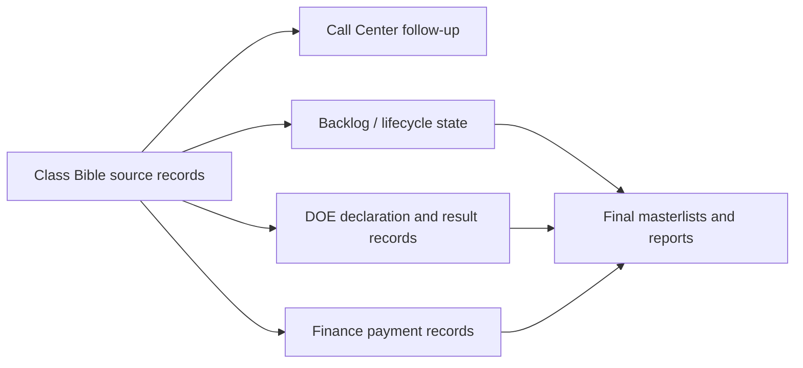
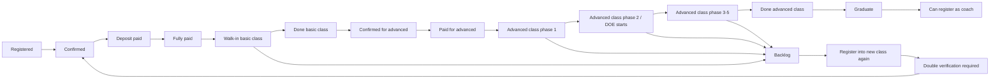

# Business Logic Map

## Working Interpretation

The Dcode Lark system appears to be organized around cohort operations. Class Bible holds the person/class layer, while DOE, Call Center, Finance, and Backlog attach status, results, follow-up, and payment logic to those people.

## Main Areas

| Area | Likely Role | Audit Question |
|---|---|---|
| Class Bible | Person, class, coach, and cohort master layer. | Which table is the true source for each person? |
| DOE | Declaration, challenge, weekly plan, and result logic. | Which DOE tables connect to which Class Bible records? |
| Call Center | Contact, confirmation, EMO/basic/high-level form flow. | Which follow-up statuses should feed back into Class Bible? |
| Finance | Payment, invoice, receipt, and course payment tracking. | Which payment status is authoritative? |
| Backlog | People not current, not consumed, moved forward, or left. | Who should be counted in reports and who should be excluded? |

## Proposed Flow

## Confirmed Student Lifecycle

The current working lifecycle should be treated as the backbone for the Dcode ERP model:

## Confirmed Rules

| Rule | Current Decision |
|---|---|
| Student vs registration | Student is the person/learner. Registration is only an intake record showing intent to join. |
| Student vs class member | Class member is the student once attached to a class/cohort. |
| Graduate | A student who has completed the required study path. |
| Coach eligibility | Only graduates can register as coaches. |
| Multiple registrations | Should not be loose or duplicated. Each path must be clearly linked and controlled. |
| Basic and advanced payment | Dcode supports one-time full payment and separate staged payment. |
| Class entry payment gate | Fully paid only. Deposit alone is not enough for class entry. |
| Backlog definition | Student dropped or did not complete the class. |
| Backlog re-entry | Backlog student can register into a new class again, but needs double verification. |
| Reporting rule | Dropped and backlog students still need to appear in reports so teachers understand the full status. |
| Schema governance | AGA should control table/column changes to protect data integrity. |

## ERP Upgrade Implication

Backlog should not be a copied side table. It should become a lifecycle state/event attached to the student, registration, payment, and class path.

Payment verification should become a controlled workflow because delayed finance approval is one of the main operational blockers. Lark can remain the staff-facing interface, but the future ERP layer should enforce clean statuses, phase tracking, payment gates, and schema governance.

## Table Role Labels

Use these labels during phase 2:

| Label | Meaning |
|---|---|
| `source` | Original authoritative table for a business object. |
| `working` | Operational table used by staff during a process. |
| `derived` | Generated or copied from another table. |
| `reporting` | Final output or dashboard-facing table. |
| `legacy` | Old, copied, inactive, or reference-only table. |

## Key Decision Needed

Gulichan should confirm report rules for these populations:

- Current class records
- Backlog records
- Old backlog moved into current class
- After-rules-leave records
- Consumed/completed records
- Finance-paid but operationally inactive records

Without that decision, the same person may be counted differently depending on which table or view is used.

## Source File

- [Business logic mapping starter](../docs/planning/dcode_business_logic_mapping_starter_2026-05-28.md)
