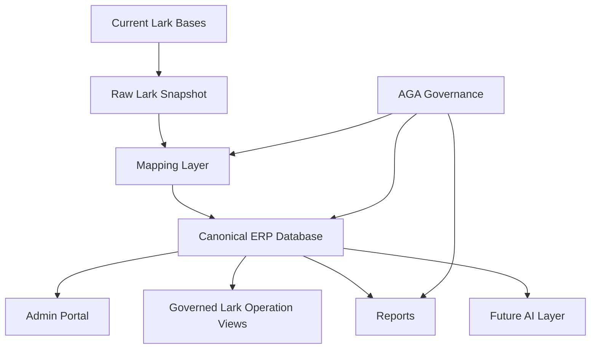

# Dcode AI-Native ERP Project Charter

## Executive Summary

Dcode is not just facing a Lark Base cleanup problem. Dcode is facing a business operating-system problem.

The current system moved from Google Sheets into Lark Base, but the operating habit stayed spreadsheet-like: duplicated cohort tables, repeated masterlists, unclear source of truth, mixed reporting and working tables, and important business logic stored in conversations instead of a governed system.

The recommended project is:

> Build Dcode's single source of truth for student journey, class operations, finance, DOE, call center, backlog, coach assignment, and reporting; then use that source of truth as the base for ERP operations and future AI-native workflows.

## Project Name

**Dcode AI-Native ERP Transformation**

Working subtitle:

**From messy Lark Base to governed student lifecycle ERP**

## Project Purpose

Create one clear, traceable operating system for Dcode Sdn Bhd.

The project should answer:

1. What are Dcode's real business objects?
2. Which workflow creates or changes each object?
3. Which table/database is allowed to be source of truth?
4. Which reports should managers and teachers trust?
5. Which parts of Lark should remain as staff operation views?
6. Which parts should move into a structured ERP database?
7. What is the upgrade path from current messy operations to AI-native operations?

## Current Diagnosis

### What Is Already Clear

| Area | Finding |
|---|---|
| Business model | Cohort-based education platform. |
| Core journey | Register -> confirm -> pay -> basic class -> advanced phases -> DOE -> graduate -> possible coach. |
| Main data container | Class Bible mixes many objects into one operational container. |
| Main technical issue | Lark Base is being used like flexible Google Sheets. |
| Main business risk | No stable source of truth for student, class status, payment, DOE, backlog, and reports. |
| Best audit example | `D.136 Class Bible. (admin dcode)` because it has 26 tables, 2,409 fields, and many repeated field groups. |
| Main duplication signal | 141-field masterlist family repeats across working, backlog, and final/report tables. |

### Biggest Weaknesses

| Weakness | Why It Matters |
|---|---|
| Person/student/coach identity is duplicated | Same person can appear as student, coach, backlog, report row, and final list row. |
| Registration is mixed with student identity | Intake records and actual student lifecycle are not cleanly separated. |
| Finance truth is copied into operations | Payment status may conflict between Finance and Class Bible. |
| DOE is treated like rows, not cohort-phase operations | Teachers need DOE by cohort and phase, not only by student row. |
| Backlog is treated like separate tables | Backlog should be lifecycle state/case, not disconnected spreadsheets. |
| Final masterlists look like source data | Reports should be outputs, not editable source truth. |
| Call center confirmation lacks full contact history | Dcode needs every call/WhatsApp/follow-up attempt logged against registration. |
| New tables/columns can be created too freely | Data structure will keep drifting unless AGA controls schema governance. |

## Recommended Project Scope

### In Scope

1. Business process documentation.
2. Ontology and object dictionary.
3. Student lifecycle state model.
4. Lark Base/table/field role audit.
5. Source-of-truth matrix.
6. Workflow registry.
7. Report registry and lineage.
8. Canonical ERP database schema.
9. Admin portal concept and local demo.
10. Migration path from Lark Base to ERP backend.
11. AGA-only Lark mapping and governance layer.

### Out Of Scope For First Phase

1. Full production system build.
2. Full AI automation.
3. Full Lark live sync for every Base.
4. Permission enforcement/login.
5. Rebuilding all 129 Bases at once.

AI should come after ERP truth is stable.

## Project Deliverables

| Deliverable | Description | Status |
|---|---|---|
| Project Wiki | Central documentation under AGA. | Started |
| Lark Base Inventory | 129 readable Base candidates screened. | Started |
| D.136 Deep Audit | Table, field, view, duplication audit. | Started |
| Ontology | Object, relationship, and lifecycle language. | Started |
| Source-of-Truth Schema | Canonical ERP data model. | Started |
| Workflow Registry | Named workflows with owners and triggers. | Started |
| Admin Portal Concept | ERP-style operating interface. | Started |
| Local Portal Demo | SQLite + React functional prototype. | Started |
| Lark CSV Schema Import | Imported D.136 schema/field inventory into local DB. | Started |
| Project Recommendation | Phase plan and upgrade path. | This document |

## Recommended System Architecture

### Layer Roles

| Layer | Role |
|---|---|
| Current Lark Bases | Existing messy data and staff habits. |
| Raw Lark Snapshot | Preserve all extracted records exactly as found. |
| Mapping Layer | Connect Lark tables/fields/records to clean objects. |
| Canonical ERP Database | Single source of truth. |
| Admin Portal | Manager/admin operating control center. |
| Lark Operation Views | Staff-facing simplified views, synced from truth. |
| Reports | Teacher, manager, finance, and DOE outputs. |
| AI Layer | Search, recommendations, summarization, automation after truth is stable. |

## Canonical Business Objects

The project should standardize these objects:

| Group | Objects |
|---|---|
| Identity | Person, Student, Coach, Graduate |
| Intake | Registration, Call Center Contact Log, Confirmation |
| Class | Program, Cohort, Class/Phase, Session, Hall, Attendance |
| Enrollment | Class Membership, Phase Participation |
| Finance | Payment Plan, Payment Submission, Finance Approval, Transfer, Adjustment |
| DOE | DOE Submission, DOE Result, Teacher Review, Coach Follow-up |
| Exception | Backlog Case, Drop/Leave Case, Re-entry Verification |
| Reporting | Teacher Report, Manager Report, Report Inclusion |
| Governance | Schema Request, Lark Mapping, Audit Log |

## Priority Workflows

| Priority | Workflow | Recommendation |
|---:|---|---|
| 1 | Student registration | Must create Person + Student + Registration, not direct class row. |
| 2 | Payment slip and finance approval | Finance approval gates enrollment. |
| 3 | Call center contact logging | Every call/WhatsApp/follow-up saved against registration. |
| 4 | Class pre-registration | Only after payment and call center gates pass. |
| 5 | First-day confirmation | Admin confirms actual attendance before student becomes confirmed class member. |
| 6 | Cohort/class/phase management | Cohort contains multiple classes/phases; sessions use halls. |
| 7 | DOE cohort dashboard | DOE tracked by cohort + advanced phase + student + coach. |
| 8 | Backlog/re-entry | Backlog is lifecycle case requiring double verification. |
| 9 | Reporting | Teacher and manager reports generated from canonical records. |
| 10 | Governance | AGA controls schema, mapping, and report definitions. |

## Recommended Project Phases

### Phase 0: Stabilize Project Language

Goal:

Freeze the shared terms so Dcode, AGA, teachers, finance, and operations do not talk past each other.

Outputs:

- Object dictionary.
- Lifecycle state list.
- Workflow name list.
- Source-of-truth decision template.

Key decision:

`Class Bible` is not one object. It is a container that mixes many objects.

### Phase 1: D.136 Model Audit

Goal:

Use D.136 as the model audit before scaling to all Bases.

Outputs:

- Table role audit.
- Field dictionary.
- Field duplication analysis.
- Source/report/legacy labels.
- Lark schema import into local mapping DB.

Decision needed:

Which D.136 tables are true sources, and which are final lists/reports?

### Phase 2: Source-of-Truth Matrix

Goal:

Define the source table/database for each critical object.

Objects to decide first:

- Person
- Student
- Registration
- Payment
- Cohort/Class Membership
- Advanced Phase Participation
- DOE
- Backlog
- Coach
- Report

Output:

A matrix saying `object -> owner -> source -> fields -> update rule -> report consumers`.

### Phase 3: ERP Backend Design

Goal:

Convert the ontology into a real database model.

Outputs:

- Canonical database schema.
- Raw Lark snapshot schema.
- Mapping tables.
- Data migration rules.
- Deduplication rules.

Important:

Do not flatten the messy Lark structure into another messy database. Keep raw and canonical separated.

### Phase 4: Admin Portal MVP

Goal:

Turn the model into usable operations screens.

MVP modules:

- Dashboard
- Persons
- Registrations
- Call Center
- Finance
- Classes & Cohorts
- DOE
- Hall Utilization
- Reports
- Governance / AGA-only Lark Mapping

Rule:

Dcode users should see clean business screens. AGA should see mapping, audit, and governance screens.

### Phase 5: Lark Cleanup And Sync

Goal:

Stop Lark from being the uncontrolled database while still letting staff work in familiar views.

Actions:

- Lock table/column creation.
- Archive legacy/copy/test Bases.
- Convert final masterlists into reports.
- Convert working tables into governed operation views.
- Sync selected views from ERP truth.

### Phase 6: AI-Native Layer

Goal:

Add AI only after the data structure is reliable.

Possible AI functions:

- Ask questions about student/cohort status.
- Generate teacher reports.
- Find finance bottlenecks.
- Summarize call center follow-ups.
- Detect duplicate people.
- Recommend backlog re-entry actions.
- Explain why a student cannot enter class.

## What To Present To Dcode

### Clear Message

> Dcode does not need more copied tables. Dcode needs one governed student lifecycle system.

### Upgrade Path

1. Document business logic.
2. Freeze ontology and lifecycle.
3. Map Lark tables to source/report/legacy roles.
4. Build single ERP source of truth.
5. Use Lark as operation view, not uncontrolled database.
6. Generate reports from ERP truth.
7. Add AI after data is stable.

### Suggested Slide Story

1. Current pain: Lark Base became Google Sheets 2.0.
2. Root cause: no ontology/source-of-truth governance.
3. Business truth: Dcode is a student lifecycle company.
4. Target model: Person -> Registration -> Payment -> Class -> Phase -> DOE -> Graduate/Coach.
5. System design: ERP backend + admin portal + governed Lark views.
6. Pilot: D.136 Class Bible.
7. Next 30 days: source-of-truth matrix and workflow registry.

## Success Criteria

| Area | Success Measure |
|---|---|
| Student identity | One person/student identity can be traced across registration, class, DOE, backlog, and coach role. |
| Payment | Finance approval clearly controls class-entry gate. |
| Class operations | Each cohort, class/phase, session, hall, and attendance status is visible. |
| DOE | DOE is shown by cohort and phase, with student and coach follow-up. |
| Call center | Every contact attempt is saved against registration. |
| Backlog | Drop, leave, no-show, and re-entry are traceable lifecycle cases. |
| Reports | Teacher and manager reports show source and inclusion rules. |
| Governance | AGA controls schema changes and Lark mapping decisions. |

## Immediate Next Actions

1. Confirm this project charter with AGA internally.
2. Review the ontology with Dcode leadership or PIC.
3. Ask Dcode to confirm the exact student lifecycle states.
4. Get row-level CSV exports for real person/student/coach records, not only field inventory.
5. Complete D.136 source-of-truth matrix.
6. Decide which D.136 tables are source, derived, reporting, or legacy.
7. Prepare the 4 June upgrade-path presentation from this charter.

## Critical Open Questions

| Question | Why It Matters |
|---|---|
| Which table is the current student master? | Prevents duplicate identity and wrong reports. |
| Which table/form creates official registration? | Controls intake and enrollment gates. |
| Which finance table is payment truth? | Payment is class-entry gate. |
| Who confirms first-day attendance? | Converts pre-registered into actual class member. |
| Which DOE submission/result table is official? | Teacher and manager reports depend on it. |
| Which final report does leadership trust? | Prevents report disputes. |
| Who may approve schema/table/field changes? | Prevents Lark Base from becoming messy again. |

## Recommended Position

AGA should position this as a transformation project, not a cleanup task.

The project should be sold and managed as:

> Business process documentation + source-of-truth ERP design + Lark governance + admin portal MVP + AI-native upgrade path.

