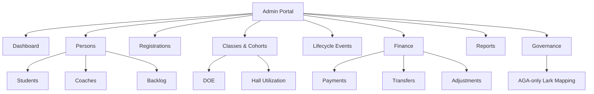
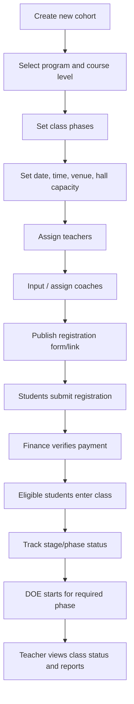
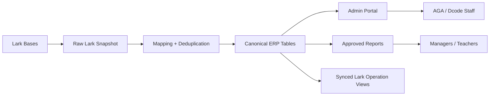

# Dcode Admin Portal Concept

## Purpose

This concept defines the future Dcode admin portal based on the canonical source-of-truth schema.

The portal should not copy the current messy Lark Base structure. It should present a clean ERP-style operating system for Dcode, while preserving Lark as a staff-facing interface where useful.

The goal is:

1. Make Dcode's business objects clear.
2. Give staff one reliable place to manage operations.
3. Protect source-of-truth data.
4. Reduce duplicated Lark tables and manual reporting work.
5. Prepare the company for AI-native operations after ERP truth is stable.

## Product Positioning

| Layer | Meaning |
|---|---|
| Current Lark Base | Existing messy operational data and legacy workflows. |
| Admin Portal | Clean ERP control center for AGA and Dcode managers. |
| Canonical Database | Single source of truth for identity, class, payment, lifecycle, DOE, and reporting. |
| Lark Operation Views | Staff-facing work surfaces synced from canonical truth. |
| AI Layer | Future search, assistant, workflow suggestions, and reporting intelligence. |

## Main Users

| User | Needs |
|---|---|
| AGA Admin | Control schema, mapping, data integrity, migration, and source-of-truth rules. |
| Dcode Manager | See current class health, student status, payment status, DOE status, backlog, and reports. |
| Operations Staff | Manage registration, class entry, phase movement, and follow-up workload. |
| Finance Staff | Verify payments, deposits, balances, transfers, refunds, and payment exceptions. |
| Call Center / Support | Follow up with registered, unpaid, risky, backlog, and re-entry students. |
| Teacher / Coach Ops | See class member status, DOE status, student background, coach assignments, and phase reports. |
| Coach | View assigned students and update allowed follow-up/assessment fields. |

## Portal Navigation



Navigation principle:

- Dcode should see the clean business portal.
- Lark Mapping is AGA-only and should be hidden from normal Dcode users.
- DOE belongs inside Classes & Cohorts because DOE is phase/cohort-based.
- Hall Utilization belongs inside Classes & Cohorts because it is class scheduling/capacity.
- Coaches belong under Persons because coach is a person role.
- Backlog belongs under Persons because backlog is a student lifecycle/person case.
- Payments belong under Finance.

## Visibility Model

| Area | Dcode Users | AGA Admin |
|---|---|---|
| Dashboard | Visible | Visible |
| Persons / Students | Visible by permission | Visible |
| Persons / Coaches | Visible by permission | Visible |
| Persons / Backlog | Visible by permission | Visible |
| Registrations | Visible by permission | Visible |
| Classes & Cohorts | Visible | Visible |
| Cohorts / DOE | Visible by permission | Visible |
| Cohorts / Hall Utilization | Visible by permission | Visible |
| Finance / Payments | Finance-only | Visible |
| Reports | Visible by permission | Visible |
| Governance | Limited, approval only | Visible |
| Lark Mapping | Hidden by default | Visible |
| Raw Lark Snapshot | Hidden | Visible |

Rule:

- Dcode should operate the clean system.
- AGA should manage messy Lark mapping, migration, field duplication, and source-of-truth protection.

## Core Modules

### 1. Dashboard

The dashboard is the management landing page.

Widgets:

- Active students by cohort.
- Registered but not fully paid.
- Fully paid and ready for class entry.
- Current class members.
- Advanced phase movement.
- DOE submission status.
- Backlog cases.
- Drop / leave cases.
- Payment verification queue.
- Data quality alerts.

Key principle:

- Dashboard numbers must come from canonical tables, not copied final masterlists.

### 2. Persons

The Persons module manages human identity and role truth.

Main objects:

- `persons`
- `students`
- `coaches`
- `class_memberships`
- `student_lifecycle_events`
- `backlog_cases`

Main screens:

| Screen | Purpose |
|---|---|
| Person List | Search all people by name, phone, IC, email, student role, coach role, or backlog status. |
| Student List | Search all students by name, phone, IC, cohort, status, payment, DOE, backlog. |
| Student Profile | One full student timeline across registration, payment, class, DOE, backlog, and reports. |
| Coach List | All coach identities and eligibility. |
| Coach Profile | Person identity, graduate link, assignments, and coach status. |
| Backlog Cases | Student/person cases that dropped or did not complete. |
| Duplicate Review | Detect same person across Lark tables and merge into one `person_id`. |
| Lifecycle Timeline | Show every status change from registered to graduate/coach eligibility. |

Important fields:

- Chinese name.
- English name.
- Phone.
- IC number.
- Email.
- Student number.
- Current status.
- Current cohort.
- Current phase.
- Payment status.
- DOE status.
- Backlog status.

Rule:

- Student, coach, and backlog are not separate people. They are roles/states linked to one `person`.

### 3. Registrations

The Registrations module manages intake before a person becomes an active class member.

Main object:

- `registrations`

Main statuses:

- Registered.
- Confirmed.
- Pending payment.
- Fully paid.
- Ready for class entry.
- Re-entry from backlog.
- Rejected / closed.

Main screens:

| Screen | Purpose |
|---|---|
| Registration Queue | All new student intake records. |
| Verification Queue | Registrations needing staff confirmation. |
| Backlog Re-entry Queue | Students registering again after backlog; requires double verification. |
| Registration Detail | Link student, payment plan, target cohort, and source Lark record. |

Rule:

- Registration is not the student identity. It is an intake record linked to a student.

### 4. Classes & Cohorts

The Classes & Cohorts module manages class batch structure, phase movement, and DOE.

Main objects:

- `programs`
- `course_levels`
- `cohorts`
- `class_phases`
- `class_memberships`
- `phase_participations`
- `doe_submissions`
- `doe_results`

Main screens:

| Screen | Purpose |
|---|---|
| Cohort List | CP136, CP137, KLCP, MYCP, and other class batches. |
| Cohort Detail | Class roster, phase status, payment readiness, DOE readiness, reports. |
| Phase Board | Track in/out for Basic, Advanced Phase 1, Advanced Phase 2, and later phases. |
| Class Entry Gate | Only fully paid students can become active class members. |
| DOE Submission List | Student-submitted declaration/homework records under the selected cohort/phase. |
| DOE Status Board | Submission status by cohort and phase. |
| DOE Result Review | Approved student outcome/result records. |
| DOE Report | Teacher/manager view of DOE progress. |

Rule:

- `cohort` means one class batch, such as `CP136`.
- Advanced class must use phase tracking instead of separate copied tables.
- DOE belongs to student + cohort + phase.

### 5. Lifecycle Events

The Lifecycle Events module is the heart of the ERP model.

Main object:

- `student_lifecycle_events`

Event types:

- Registered.
- Confirmed.
- Deposit paid.
- Fully paid.
- Entered basic class.
- Done basic class.
- Confirmed for advanced.
- Paid for advanced.
- Entered advanced phase.
- Completed advanced phase.
- DOE started.
- Dropped / 下车.
- Left after rules / 守则后离开.
- Backlog opened.
- Backlog re-entry requested.
- Transfer payment / 转款.
- Transfer seat / 转名额.
- Graduated.
- Eligible for coach registration.

Main screens:

| Screen | Purpose |
|---|---|
| Event Timeline | Show student history. |
| Event Review | Approve sensitive changes like backlog re-entry or transfer. |
| Event Rules | Define which statuses affect reports, finance, and class eligibility. |

Rule:

- Backlog, drop, leave, transfer, and graduation should be events, not scattered tables.

### 6. Finance

The Finance module is the payment source of truth.

Main objects:

- `payment_plans`
- `payments`
- `finance_adjustments`
- `transfer_cases`

Main screens:

| Screen | Purpose |
|---|---|
| Payment Verification Queue | Bank-in evidence waiting for approval. |
| Student Payment Profile | Deposit, balance, full payment, transfer, refund, adjustment. |
| Payment Exceptions | Active but unpaid, paid but not active, duplicate payment, wrong reference. |
| Transfer Cases | 转款 and 转名额 management. |
| Finance Adjustments | Refunds, discounts, corrections, and approved manual finance changes. |

Rules:

- Fully paid is required for class entry.
- Deposit alone does not allow class entry.
- Finance owns payment truth.
- Lark Class Bible can display payment status only if synced from finance truth.

### 7. Coaches

The Coaches section sits inside the Persons module. It manages coach identity, eligibility, and assignment.

Main objects:

- `coaches`
- `coach_assignments`
- `persons`
- `students`

Main screens:

| Screen | Purpose |
|---|---|
| Coach List | All coach identities. |
| Coach Eligibility | Students who graduated and can register as coaches. |
| Assignment Board | Coach-to-student/cohort/phase assignments. |
| Coach Performance | Student status, DOE status, grade, follow-up results. |

Rule:

- Coach is a role of a person.
- Only graduate students can become eligible to register as coaches.

### 8. Backlog

The Backlog section sits inside the Persons module. It shows backlog as a controlled person/student case system.

Main objects:

- `backlog_cases`
- `student_lifecycle_events`
- `registrations`
- `class_memberships`

Main screens:

| Screen | Purpose |
|---|---|
| Backlog Queue | Students who dropped or did not complete. |
| Re-entry Review | Backlog students trying to register again. |
| Backlog Reason Analysis | Why students dropped, deferred, or failed to complete. |
| Backlog Report Inclusion | Whether backlog appears in teacher/manager reports. |

Rules:

- Backlog means student dropped or did not complete.
- Backlog re-entry requires double verification.
- Backlog students still need to appear in reports where teachers need full context.

### 9. Reports

The Reports module replaces uncontrolled final masterlist copying.

Main objects:

- `reports`
- `report_inclusions`

Main screens:

| Screen | Purpose |
|---|---|
| Report Registry | All approved reports and owners. |
| Report Builder | Define cohort, phase, status, backlog, drop, DOE, and payment filters. |
| Inclusion Rules | Who appears and why. |
| Report Preview | See final report before publishing to Lark or PDF. |

Rules:

- Final Masterlist is a report output, not source truth by default.
- Every report must declare inclusion/exclusion rules.
- Report numbers must be traceable to canonical records.

### 10. AGA-Only Lark Mapping

The Lark Mapping module connects messy Lark data to the clean schema.

This module is hidden from Dcode Sdn Bhd by default. It is for AGA admin, migration, audit, and technical operations only.

Main objects:

- `lark_sources`
- `lark_tables`
- `lark_fields`
- `lark_records_raw`
- `lark_record_mappings`

Main screens:

| Screen | Purpose |
|---|---|
| Lark Base Inventory | All Bases, owners, table counts, scan status. |
| Table Role Mapping | Source, working, derived, reporting, legacy, unknown. |
| Field Dictionary | Field names, types, options, duplicate fields. |
| Record Mapping | Lark record to canonical object mapping. |
| Sync Status | Last extraction, errors, unmapped records, conflicts. |

Rules:

- Raw Lark data must be preserved exactly.
- Canonical data should be clean.
- Every canonical record should trace back to Lark evidence where possible.
- Dcode users should not need to see raw Lark mapping unless AGA explicitly shares an audit view.

### 11. Governance

The Governance module protects data integrity.

Main object:

- `schema_change_requests`

Main screens:

| Screen | Purpose |
|---|---|
| Schema Change Requests | New table/field/status/report requests. |
| Permission Matrix | Who can view/edit/approve each object. |
| Data Quality Alerts | Duplicates, missing payment truth, unmapped Lark records, report conflicts. |
| Audit Log | Who changed what and when. |

Rules:

- AGA controls schema changes.
- Dcode staff should not freely create new source fields/tables like Google Sheets.
- Business owners approve report definitions.

## Suggested Portal Layout

```text
Top Bar
  Dcode Admin Portal | Search student / phone / cohort | Alerts | User

Left Navigation
  Dashboard
  Persons
    Students
    Coaches
    Backlog
  Registrations
  Classes & Cohorts
    DOE
    Hall Utilization
  Lifecycle Events
  Finance
    Payments
    Transfers
    Adjustments
  Reports
  Governance
    Schema Requests
    Permissions
    Audit Log
    AGA-only Lark Mapping

Main Area
  List / board / detail / timeline depending on module

Right Panel
  Selected record summary
  Source Lark links
  Data quality warnings
  Next actions
```

## Important Record Pages

### Student Profile

The most important page in the portal.

Sections:

1. Identity.
2. Current status.
3. Registration history.
4. Finance / payment status.
5. Class/cohort membership.
6. Phase participation.
7. DOE status.
8. Coach assignment.
9. Backlog/drop/leave events.
10. Report appearances.
11. Source Lark records.
12. Audit log.

### Cohort Detail

Sections:

1. Cohort overview.
2. Class phases.
3. Roster.
4. Finance/payment readiness.
5. DOE readiness.
6. Backlog/drop list.
7. Coach assignment.
8. Reports.
9. Data quality warnings.

### New Class / Cohort Setup

This is the workflow Dcode Admin uses when opening a new class batch.

Flow:



Main fields:

| Area | Fields |
|---|---|
| Cohort | `cohort_code`, `program_id`, `course_level_id`, `center`, `status` |
| Schedule | `start_date`, `end_date`, `class_dates`, `class_time`, `venue_id`, `hall_id` |
| Capacity | `hall_capacity`, `target_students`, `confirmed_students`, `fully_paid_students`, `checked_in_students` |
| Staff | `teacher_id`, `operation_pic`, `finance_pic`, `support_pic` |
| Coach | `coach_id`, `coach_role`, `assigned_group`, `assigned_students`, `assignment_status` |
| Registration | `registration_open_at`, `registration_close_at`, `registration_link`, `payment_required` |
| DOE | `doe_required`, `doe_start_phase_id`, `doe_report_owner` |

Rules:

- A cohort must belong to a course level.
- A cohort can have many phases.
- A cohort can have many coaches.
- Students enter through registrations.
- Registration links to payment, class membership, phase participation, and DOE.
- DOE should be generated/linked by student + cohort + phase.

### Class Operations Board

The Class Operations Board is what Dcode Admin, teachers, and operations use during a class.

Views:

| View | Purpose |
|---|---|
| Registration View | New student registrations and confirmation status. |
| Payment Gate View | Deposit/full payment, pending verification, blocked class entry. |
| Class Entry View | Who can enter, who is checked in, who is absent, who is blocked. |
| Coach Assignment View | Coaches and assigned students/groups. |
| Stage / Phase View | Basic, advanced phase 1, advanced phase 2, and later phases. |
| DOE View | DOE submissions, missing DOE, approved results by phase. |
| Backlog / Drop View | Students dropped, left, or moved to backlog. |
| Teacher Report View | Full class status by student for teaching and review. |

Recommended board columns:

1. Registered.
2. Confirmed.
3. Pending payment verification.
4. Fully paid.
5. Ready for class entry.
6. Entered class.
7. Current phase.
8. DOE required.
9. DOE submitted.
10. Completed phase.
11. Backlog / dropped / left.
12. Graduated.

### Teacher Class Status View

Teachers should not need to understand Lark table structure.

Teacher view should show:

| Section | What Teacher Sees |
|---|---|
| Class Summary | Cohort, phase, date, hall, total students, entered students, backlog/drop count. |
| Student Context | Name, background, payment gate status, class phase, coach, DOE status. |
| Stage Status | Who is in each stage, who completed, who is stuck, who dropped. |
| DOE Status | Required, submitted, missing, approved, result. |
| Coach Status | Coach assigned, student coverage, follow-up notes. |
| Exceptions | Unpaid, not checked in, health issue, backlog, leave, transfer. |
| Reports | Approved class report and phase report. |

Rule:

- Teachers should see enough status to run the class, but not raw finance details or messy Lark mapping.

### Hall Utilization

Hall utilization tracks how Dcode uses physical class halls/venues across all cohorts.

New canonical objects needed:

| Table | Purpose | Key Fields |
|---|---|---|
| `venues` | A center or class location. | `id`, `name`, `address`, `status` |
| `halls` | A hall/room inside a venue. | `id`, `venue_id`, `hall_name`, `capacity`, `status` |
| `class_sessions` | A scheduled class event. | `id`, `cohort_id`, `class_phase_id`, `hall_id`, `session_start`, `session_end`, `expected_students`, `checked_in_students` |
| `attendance_records` | Student attendance/check-in. | `id`, `class_session_id`, `student_id`, `status`, `checked_in_at`, `notes` |

Hall dashboard metrics:

| Metric | Meaning |
|---|---|
| Scheduled hall hours | Total hours a hall is booked. |
| Used hall hours | Total hours class actually ran. |
| Capacity utilization | `checked_in_students / hall_capacity`. |
| Expected utilization | `expected_students / hall_capacity`. |
| No-show count | Expected students minus checked-in students. |
| Over-capacity risk | Expected or checked-in students exceed hall capacity. |
| Idle hall slots | Available hall time with no scheduled class. |
| Cohort occupancy | Utilization by cohort/class batch. |

Hall utilization views:

| View | Purpose |
|---|---|
| Calendar View | Hall schedule by day/week/month. |
| Hall Utilization Dashboard | Capacity and usage across all halls. |
| Cohort Venue View | Which class uses which hall and when. |
| Overlap Warning | Detect double-booked hall/time. |
| Capacity Warning | Detect class size above hall capacity. |

Rule:

- Hall utilization belongs under Classes & Cohorts because it is class scheduling and capacity management.

### Finance Payment Verification Detail

Sections:

1. Student identity.
2. Registration target.
3. Payment plan.
4. Submitted evidence.
5. Bank-in reference.
6. Verification action.
7. Class-entry impact.
8. Transfer/refund/adjustment handling.

## Conceptual Data Flow



## Phase 1 Portal Scope

The first portal version should focus on control and clarity, not every workflow.

Must include:

1. Dashboard.
2. Person / Student Profile.
3. Classes & Cohorts overview.
4. Canonical source-of-truth schema viewer.
5. Basic Finance payment status.
6. Basic DOE status inside Cohort Detail.
7. Basic Backlog status inside Person Profile.
8. Basic report registry.

AGA-only include:

1. D.136 Lark Mapping.
2. Table role mapping.
3. Field dictionary and duplication analysis.
4. Manual mapping review.

Can wait:

1. Full workflow automation.
2. AI assistant.
3. Advanced report builder.
4. Coach mobile interface.
5. Full payment gateway integration.

## Phase 2 Portal Scope

Add operational workflows:

1. Registration queue.
2. Finance payment verification queue.
3. Cohort/phase board.
4. Backlog case management under Persons.
5. DOE status board inside Cohorts.
6. Coach assignment board under Persons.
7. Data quality alert center.

## Phase 3 Portal Scope

Add AI-native features after source truth is stable:

1. Ask AI about any student/cohort/report.
2. Explain why a student appears in a report.
3. Detect duplicate students.
4. Detect inconsistent payment/class status.
5. Suggest which Lark tables can be archived.
6. Generate boss summaries.
7. Generate workflow improvement suggestions.

## First Concept Decision

The portal should be designed as an **ERP control center**, not a replacement spreadsheet.

Lark can stay as a familiar operation surface, but the portal and canonical database should decide:

- who the student is,
- which class/cohort they belong to,
- whether they are fully paid,
- which phase they are in,
- whether they are backlog/drop/leave,
- which DOE work they submitted,
- which report they should appear in.

That is the single source of truth.
