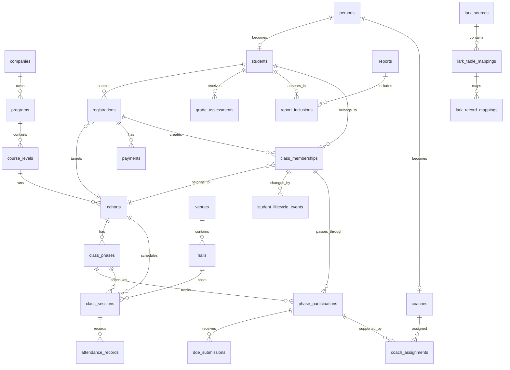

# Dcode Canonical Source Of Truth Schema

## Purpose

This page defines the clean database schema that should become Dcode's single source of truth.

The goal is not to copy the current Lark Base structure. The goal is to extract all messy Lark data into a clean ontology-based ERP model, then let Lark become an operation interface on top of stable database truth.

## Core Principle

Dcode language and system language must both exist:

| Dcode Language | System / Ontology Meaning |
|---|---|
| Class Bible | A container that mixes student, coach, registration, class membership, backlog, DOE, grading, and reports. |
| 学员 NEWBIBLE | Student / class member source candidate. |
| 教练 NEWBIBLE | Coach source candidate. |
| 课程报名 | Registration intake. |
| WHOLE-MASTERLIST | Derived class member/report bridge. |
| FINAL MASTERLIST | Reporting output, not source truth by default. |
| Backlog | Student lifecycle event/status, not a separate disconnected table. |
| 守则后离开 / 下车 | Drop/leave lifecycle event. |
| DOE 宣告 | Declaration/homework/event submitted by student. |
| Grade ABC | Segmentation/grade assessment. |

## Target Architecture

| Layer | Role |
|---|---|
| Raw Lark Snapshot | Stores every extracted Lark Base/table/field/record exactly as found. |
| Canonical ERP Tables | Clean source-of-truth objects and relationships. |
| Mapping Tables | Connect Lark record IDs to canonical ERP IDs. |
| Lark Operation Views | Staff-facing editable views after governance. |
| Reports / AI Layer | Reads canonical tables and documented report definitions. |

Related product concept:

- [Dcode Admin Portal Concept](Dcode-Admin-Portal-Concept.md): future ERP control center built on this schema.

## Canonical Entity Relationship Diagram

## Canonical Tables

### Identity And People

| Table | Purpose | Key Fields |
|---|---|---|
| `companies` | Business entity, e.g. Dcode Sdn Bhd. | `id`, `name`, `registration_no`, `status` |
| `persons` | One human identity before student/coach role. | `id`, `chinese_name`, `english_name`, `phone`, `email`, `ic_no`, `gender`, `date_of_birth`, `normalized_phone`, `dedupe_key` |
| `students` | Person on learning/customer path. | `id`, `person_id`, `student_no`, `current_status`, `first_registered_at`, `is_graduate`, `graduate_at` |
| `coaches` | Person eligible/registered as coach. | `id`, `person_id`, `coach_no`, `coach_status`, `eligible_from_student_id`, `approved_at` |

Source rule:

- Person identity should be centralized in `persons`.
- Student and coach are roles, not separate duplicated people.
- A graduate student can later become a coach.

### Program And Class Structure

| Table | Purpose | Key Fields |
|---|---|---|
| `programs` | Dcode product/learning track. | `id`, `company_id`, `name`, `description`, `status` |
| `course_levels` | Basic, advanced, 高一, 高二, 高三, 高四, DOE. | `id`, `program_id`, `code`, `name`, `sequence_no`, `requires_payment`, `requires_doe` |
| `cohorts` | Numbered class cycle, e.g. CP136. | `id`, `course_level_id`, `cohort_code`, `center`, `start_date`, `end_date`, `status` |
| `class_phases` | Phase inside class/cohort. | `id`, `cohort_id`, `phase_code`, `phase_name`, `sequence_no`, `starts_doe`, `status` |
| `venues` | A center or class location. | `id`, `name`, `address`, `status` |
| `halls` | A hall/room inside a venue. | `id`, `venue_id`, `hall_name`, `capacity`, `status` |
| `class_sessions` | One scheduled class session in a hall. | `id`, `cohort_id`, `class_phase_id`, `hall_id`, `session_start`, `session_end`, `expected_students`, `checked_in_students`, `session_status` |
| `attendance_records` | Student attendance/check-in for a session. | `id`, `class_session_id`, `student_id`, `class_membership_id`, `attendance_status`, `checked_in_at`, `notes` |

Source rule:

- Advanced class must be modeled as phases, not as many copied tables.
- DOE starts around advanced phase two / 高二.
- Hall utilization is calculated from `halls`, `class_sessions`, and `attendance_records`.

### Registration And Membership

| Table | Purpose | Key Fields |
|---|---|---|
| `registrations` | Student intent/intake record. | `id`, `student_id`, `target_cohort_id`, `registration_source`, `registered_at`, `registration_status`, `is_backlog_reentry`, `verification_status`, `verified_by`, `verified_at` |
| `class_memberships` | Student attached to a cohort/class. | `id`, `student_id`, `cohort_id`, `registration_id`, `membership_status`, `entered_at`, `completed_at`, `closed_at` |
| `phase_participations` | Student in/out for each basic/advanced phase. | `id`, `class_membership_id`, `class_phase_id`, `phase_status`, `entered_at`, `completed_at`, `left_at`, `leave_reason` |

Source rule:

- Registration is not student identity.
- Class member is student + cohort.
- A student should not become active class member until payment rule is satisfied.

### Lifecycle And Exceptions

| Table | Purpose | Key Fields |
|---|---|---|
| `student_lifecycle_events` | Every meaningful student status change. | `id`, `student_id`, `registration_id`, `class_membership_id`, `phase_participation_id`, `event_type`, `event_status`, `event_at`, `reason`, `notes`, `created_by`, `verified_by` |
| `backlog_cases` | Current backlog case view over lifecycle events. | `id`, `student_id`, `registration_id`, `class_membership_id`, `backlog_reason`, `opened_at`, `closed_at`, `reentry_registration_id`, `double_verification_status` |
| `transfer_cases` | 转款 / 转名额 handling. | `id`, `student_id`, `from_registration_id`, `to_registration_id`, `transfer_type`, `amount`, `currency`, `status`, `approved_by`, `approved_at` |

Source rule:

- Backlog is a lifecycle event/case, not a separate table truth.
- Re-entry from backlog requires double verification.
- Drop/leave records must still appear in teacher/manager reports.

### Finance

| Table | Purpose | Key Fields |
|---|---|---|
| `payment_plans` | One-time full payment or staged payment plan. | `id`, `registration_id`, `plan_type`, `total_amount`, `currency`, `deposit_required`, `full_payment_required_before_entry` |
| `payments` | Payment evidence and verification. | `id`, `registration_id`, `payment_plan_id`, `payment_type`, `amount`, `currency`, `payment_method`, `bank_in_reference`, `paid_at`, `verification_status`, `verified_by`, `verified_at` |
| `finance_adjustments` | Refunds, transfers, discounts, correction entries. | `id`, `payment_id`, `adjustment_type`, `amount`, `reason`, `approved_by`, `approved_at` |

Source rule:

- Fully paid is the class-entry gate.
- Deposit is not enough to enter class.
- Finance owns payment truth; Class Bible can display synced status only.

### DOE, Grade, Coach

| Table | Purpose | Key Fields |
|---|---|---|
| `doe_submissions` | Student DOE/homework/declaration. | `id`, `student_id`, `phase_participation_id`, `submission_type`, `submitted_at`, `content`, `status`, `source_lark_record_id` |
| `doe_results` | DOE summary/result. | `id`, `student_id`, `phase_participation_id`, `result_type`, `score`, `result_status`, `approved_by`, `approved_at` |
| `grade_assessments` | EMO / coach-filled Grade ABC. | `id`, `student_id`, `class_membership_id`, `grade_type`, `grade_value`, `assessed_by`, `assessed_at`, `notes` |
| `coach_assignments` | Coach assigned to student/cohort/phase. | `id`, `coach_id`, `student_id`, `class_membership_id`, `phase_participation_id`, `assignment_status`, `assigned_at`, `ended_at` |

Source rule:

- DOE belongs to student + phase.
- Coach assignment belongs to student/cohort/phase, not copied names only.
- Grade ABC must keep source: EMO, coach-filled, formula, or final approved.

### Reports And Governance

| Table | Purpose | Key Fields |
|---|---|---|
| `reports` | Approved report definition. | `id`, `report_name`, `report_type`, `owner_id`, `definition_status`, `approved_by`, `approved_at` |
| `report_inclusions` | Who appears in a report and why. | `id`, `report_id`, `student_id`, `class_membership_id`, `phase_participation_id`, `inclusion_status`, `inclusion_reason` |
| `schema_change_requests` | Governance for new tables/fields. | `id`, `request_type`, `object_name`, `field_name`, `reason`, `requested_by`, `approved_by`, `status` |

Source rule:

- Final Masterlist should become report output, not source truth.
- Every report must declare inclusion/exclusion rules.
- AGA should approve schema/table/column changes.

### Lark Extraction And Mapping

| Table | Purpose | Key Fields |
|---|---|---|
| `lark_sources` | Lark Base metadata. | `id`, `base_token`, `base_name`, `owner_name`, `url`, `access_status`, `last_scanned_at` |
| `lark_tables` | Raw Lark table metadata. | `id`, `lark_source_id`, `table_id`, `table_name`, `table_role`, `field_count`, `view_count` |
| `lark_fields` | Raw Lark field metadata. | `id`, `lark_table_id`, `field_id`, `field_name`, `field_type`, `options_json`, `field_order` |
| `lark_records_raw` | Raw extracted records, stored as JSON. | `id`, `lark_table_id`, `record_id`, `record_json`, `extracted_at`, `record_hash` |
| `lark_record_mappings` | Link raw Lark records to canonical ERP records. | `id`, `lark_table_id`, `lark_record_id`, `canonical_table`, `canonical_id`, `confidence`, `mapping_status` |

Source rule:

- Raw Lark data should be preserved exactly.
- Canonical ERP data should be clean and normalized.
- Mapping tables allow traceability back to Lark.

## D.136 Mapping To Canonical Schema

| Current D.136 Table | Current Role | Canonical Target |
|---|---|---|
| `✅✅136学员-NEWBIBLE_（Dcode)` | Candidate source | `persons`, `students`, `class_memberships`, selected `student_lifecycle_events` |
| `✅✅136教练-NEWBIBLE_（Dcode)` | Candidate source | `persons`, `coaches`, `coach_assignments` |
| `✅课程报名` | Candidate source | `registrations` |
| `✅✅136-WHOLE-MASTERLIST【基础-高四】` | Derived/report bridge | `class_memberships`, `phase_participations`, `report_inclusions` |
| `基础 / 高阶 FINAL MASTERLIST` | Reporting | `reports`, `report_inclusions` |
| `基础Backlog / 高阶Backlog / 旧Backlog` | Working/reporting | `student_lifecycle_events`, `backlog_cases` |
| `守则后离开 / 下车` | Reporting/exception | `student_lifecycle_events` |
| `高阶二2Call` | Working | `student_lifecycle_events`, `phase_participations`, call/follow-up events |
| `DOE 宣告 / 事业成就表` | Working | `doe_submissions`, `doe_results` |
| `Grade ABC【EMO】` | Working | `grade_assessments` |
| `Grade ABC【教练填】` | Working | `grade_assessments` |
| `🔥-学员海星个人结果` | Reporting/result | `doe_results`, `reports` |

## Extraction Strategy

### Step 1: Preserve Raw Lark

Extract every Base, table, field, view, form, workflow, dashboard, and record into raw tables.

Do not clean during raw extraction.

Output:

- `lark_sources`
- `lark_tables`
- `lark_fields`
- `lark_records_raw`

### Step 2: Build Canonical Identity

Create `persons` first, using name, phone, email, IC, Lark identity, and dedupe rules.

Output:

- One durable `person_id`.
- Student/coach roles linked back to the same person.

### Step 3: Build Student Lifecycle

Convert registration, payment, class entry, phase entry, backlog, drop, transfer, graduation, and coach eligibility into lifecycle events.

Output:

- `registrations`
- `class_memberships`
- `phase_participations`
- `student_lifecycle_events`
- `backlog_cases`

### Step 4: Build Finance Truth

Move payment evidence and verification into finance tables.

Output:

- `payment_plans`
- `payments`
- `finance_adjustments`

### Step 5: Build DOE And Reports

Move DOE submissions/results and final reports into structured tables.

Output:

- `doe_submissions`
- `doe_results`
- `grade_assessments`
- `reports`
- `report_inclusions`

## Clean Schema Rules

| Rule | Reason |
|---|---|
| One person record per human. | Prevent duplicate student/coach identity. |
| Student and coach are roles. | One graduate can later become coach. |
| Registration is not identity. | A registration is an intake event. |
| Class membership is student + cohort. | This controls class reporting. |
| Phase participation is required. | Advanced class has 4-5 phases. |
| Backlog is lifecycle event/case. | Prevent scattered backlog tables. |
| Payment truth belongs to finance. | Fully paid controls class entry. |
| Reports are outputs. | Final Masterlist should not be edited as truth. |
| Lark fields are mapped, not copied blindly. | Keeps current Lark traceability without preserving chaos. |
| AGA controls schema changes. | Prevents Google Sheet-style table/column sprawl. |

## First Single Source Of Truth Decision

For D.136, the first working source-of-truth decision should be:

| Object | Temporary Source Candidate | Target Canonical Table |
|---|---|---|
| Student identity | `✅✅136学员-NEWBIBLE_（Dcode)` | `persons`, `students` |
| Coach identity | `✅✅136教练-NEWBIBLE_（Dcode)` | `persons`, `coaches` |
| Registration | `✅课程报名` | `registrations` |
| Class membership | `✅✅136学员-NEWBIBLE_（Dcode)` + `WHOLE-MASTERLIST` verification | `class_memberships` |
| Backlog | Backlog table family | `student_lifecycle_events`, `backlog_cases` |
| Payment | Finance fields now, finance Base later | `payment_plans`, `payments` |
| DOE | DOE declaration tables | `doe_submissions`, `doe_results` |
| Reports | FINAL MASTERLIST tables | `reports`, `report_inclusions` |

## Open Decisions

1. Which exact finance Base/table owns verified payment truth?
2. Which field uniquely identifies a student across cohorts?
3. Should `学号`, phone, IC, or Lark identity be the primary dedupe anchor?
4. Which D.136 141-field table is the upstream source for the other masterlists?
5. Which reports must include dropped/backlog students?
6. Who in Dcode approves final report definitions?
7. Which Lark tables should become staff-facing views after ERP migration?
