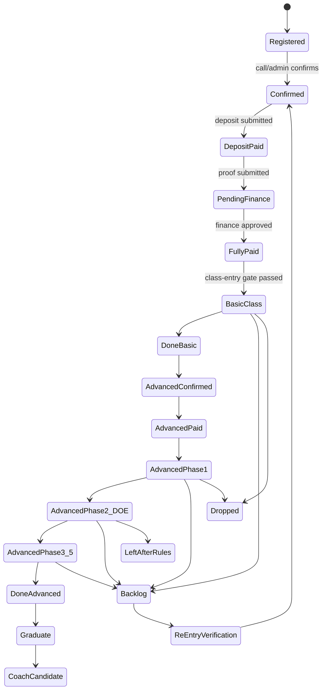

# Dcode Ontology Operating Model

## Purpose

This page is the clear object model to use before changing the localhost demo.

It reconciles the project wiki with the 2026-05-29 active Lark Base deep audits. The goal is to stop treating Dcode's current Lark table names as the system design. Dcode language should remain visible, but the demo should operate on clean business objects.

## Main Finding

Dcode is an education operation system built around cohorts, class progression, finance gates, coach support, DOE declarations, backlog recovery, and reporting.

The current Lark structure is not a clean ontology. It is a collection of cohort Bases and copied tables:

| Evidence | Meaning |
|---|---|
| Class Bible Bases | Mixed student, coach, registration, payment, call center, class phase, backlog, DOE, and reporting data. |
| DOE Bases | Declaration, weekly plan, coach review, result, Grade ABC, dashboard, and challenge tracking. |
| Customer Service Backlog Base | Follow-up and backlog summary layer connected to cohort Class Bible data. |
| 0 workflows in all audited active Bases | Current workflow is mostly manual status movement through tables, views, dashboards, and staff habits. |
| Many 141-field masterlist copies | Reporting and working tables are being copied like spreadsheets, so source truth is unclear. |

## Dcode Language To System Language

| Dcode Term | Clean System Meaning | Demo Treatment |
|---|---|---|
| Class Bible | Operating container, not one object. | Show as source area, then split into real objects. |
| 学员 NEWBIBLE | Student source candidate. | Map into Person, Student, Class Membership, Lifecycle Events. |
| 教练 NEWBIBLE | Coach source candidate. | Map into Person, Coach, Coach Assignment. |
| 课程报名 | Registration intake. | Create Person + Student + Registration, then wait for gates. |
| WHOLE-MASTERLIST | Derived class/report bridge. | Show as derived, not source truth. |
| FINAL MASTERLIST | Report output. | Show as report inclusion, not editable truth. |
| Backlog | Student exception/lifecycle case. | Model as Backlog Case and Lifecycle Event. |
| 守则后离开 / 下车 | Formal leave/drop lifecycle event. | Keep visible in reports and teacher view. |
| 高阶一 / 高阶二 / 高三 / 高四 | Advanced class phases. | Model as Phase Participation. |
| DOE 宣告 | Student declaration/homework/challenge evidence. | Model as DOE Submission. |
| 事业成就表 | DOE achievement/result evidence. | Model as DOE Result. |
| Grade ABC / EMO | Segmentation/assessment. | Model as Grade Assessment with source. |
| 客服 Call / Message | Follow-up evidence. | Model as Contact Log attached to Registration or Backlog Case. |
| 转款 / 转名额 | Finance or seat transfer. | Model as Transfer Case. |

## Core Objects

### Identity

| Object | Definition | Important Rule |
|---|---|---|
| Person | One human identity before role. | Deduplicate by phone, IC, email, and name. |
| Student | Person on the Dcode learning/customer path. | Student is not the same as registration. |
| Coach | Person supporting students. | A coach may be a graduate student. |
| Graduate | Student who completed required path. | Graduate can become coach candidate. |

### Course And Class

| Object | Definition | Important Rule |
|---|---|---|
| Program | Dcode learning product/track. | Parent of course levels. |
| Course Level | Basic, Advanced, DOE-related stages. | Must preserve Dcode names. |
| Cohort | Numbered cycle such as CP135, CP136, CP137. | Cohort is not the person source. |
| Class Phase | Basic, 高一, 高二, 高三, 高四. | Advanced must be phase-based. |
| Class Session | One scheduled class delivery event. | Connect to hall, date, attendance. |
| Hall | Physical class room. | Needed for utilization demo. |
| Attendance | Evidence of entry/participation. | Should update phase progress. |

### Intake And Enrollment

| Object | Definition | Important Rule |
|---|---|---|
| Registration | Intent/intake record for a target class. | Creates or links Person + Student. |
| Confirmation | Staff confirmation that path/details are valid. | Usually call center/admin evidence. |
| Class Membership | Student attached to a cohort. | Created only after required gates pass. |
| Phase Participation | Student in/out status for each class phase. | Needed for advanced class reality. |

### Finance

| Object | Definition | Important Rule |
|---|---|---|
| Payment Plan | Full payment or staged basic/advanced payment. | Defines what must be paid before entry. |
| Payment Submission | Evidence of paid amount/bank-in. | Not final until verified. |
| Finance Approval | Finance verification of payment evidence. | Fully paid gates class entry. |
| Finance Adjustment | Refund, correction, waiver, discount. | Requires approval note. |
| Transfer Case | 转款 or 转名额. | Must link from old registration to new target. |

### Support And Exception

| Object | Definition | Important Rule |
|---|---|---|
| Contact Log | Call, WhatsApp, message, confirmation attempt. | Attach to registration or backlog case. |
| Backlog Case | Student not active but still operationally relevant. | Not a disconnected table. |
| Drop Case | Student dropped or 下车. | Still appears in reports. |
| Leave Case | 守则后离开 or formal leave. | Needs reason and phase. |
| Re-entry Verification | Backlog student returning into a new class. | Requires double verification. |

### DOE And Coach

| Object | Definition | Important Rule |
|---|---|---|
| DOE Submission | Student declaration, weekly plan, or challenge input. | Belongs to student + phase. |
| DOE Result | Outcome, score, or challenge result. | Approved before reporting. |
| Weekly Plan | DOE operating plan by week/day. | Belongs to student + DOE phase. |
| Coach Assignment | Coach linked to student/cohort/phase. | Do not store coach only as free text. |
| Coach Review | Coach verification/comment/result. | Should feed DOE result and Grade ABC. |
| Grade Assessment | ABC/EMO segmentation. | Keep source: EMO, coach, formula, final. |

### Reporting And Governance

| Object | Definition | Important Rule |
|---|---|---|
| Report Definition | Approved logic for a report/dashboard. | Must document inclusion/exclusion rules. |
| Report Inclusion | Why a student appears in a report. | Prevent double-counting. |
| Source Base | Lark Base metadata. | Keep scanned counts and owner/status. |
| Source Table | Lark table metadata. | Role must be source, working, derived, reporting, or legacy. |
| Field Mapping | Lark field to clean object field. | Required before sync/import. |
| Schema Request | Request to add/change table or field. | AGA/governance approval required. |
| Audit Log | Who changed what and why. | Required for demo credibility. |

## Object Relationship Picture

```mermaid
flowchart LR
    Person["Person"] --> Student["Student"]
    Person --> Coach["Coach"]
    Student --> Registration["Registration"]
    Registration --> PaymentPlan["Payment Plan"]
    PaymentPlan --> PaymentSubmission["Payment Submission"]
    PaymentSubmission --> FinanceApproval["Finance Approval"]
    FinanceApproval --> ClassMembership["Class Membership"]
    ClassMembership --> PhaseParticipation["Phase Participation"]
    PhaseParticipation --> Attendance["Attendance"]
    PhaseParticipation --> DOEs["DOE Submission"]
    DOEs --> DOEResult["DOE Result"]
    Coach --> CoachAssignment["Coach Assignment"]
    CoachAssignment --> PhaseParticipation
    CoachAssignment --> CoachReview["Coach Review"]
    CoachReview --> GradeAssessment["Grade Assessment"]
    Student --> ContactLog["Contact Log"]
    Student --> BacklogCase["Backlog Case"]
    BacklogCase --> Reentry["Re-entry Verification"]
    Reentry --> Registration
    PhaseParticipation --> ReportInclusion["Report Inclusion"]
    DOEResult --> ReportInclusion
    GradeAssessment --> ReportInclusion
```

## Student Lifecycle

## Source-Of-Truth Rules

| Truth Area | Source Rule |
|---|---|
| Identity | Person is the root. Student and Coach are roles. |
| Registration | Registration is intake intent, not the student itself. |
| Payment | Finance approval owns payment truth. Class Bible can display synced payment status only. |
| Class Entry | Fully paid is the normal class-entry gate. |
| Class Progress | Phase Participation owns in/out/completion across Basic and Advanced phases. |
| DOE | DOE belongs to student + advanced phase + coach assignment. |
| Backlog | Backlog is a lifecycle case/event, not a side table source. |
| Reporting | Final Masterlist is a report output unless explicitly approved as source. |
| Legacy Tables | Old/copy/cross-cohort tables must be labeled legacy before use. |
| Workflow | Since audited workflow count is 0, the demo should show manual approval gates and proposed automation readiness. |

## Demo Implication

Before changing localhost screens, the demo should be judged against this object model:

| Demo Area | Required Real Dcode Meaning |
|---|---|
| Students | Person + Student + current lifecycle + source mapping. |
| Registrations | Intake record, target cohort, contact status, payment gate. |
| Finance | Payment submission and finance approval that unlocks class entry. |
| Classes & Cohorts | Cohort, phase, session, hall, attendance, phase participation. |
| DOE | Declaration, weekly plan, coach review, result, Grade ABC. |
| Backlog | Open exception case with reason, follow-up, and re-entry verification. |
| Reports | Explain exactly why a student is included or excluded. |
| Governance | Source Base/table/field mapping, legacy warnings, schema change approvals. |

## What The Demo Should Not Pretend

- Do not pretend Lark workflows already exist. The audit found 0 workflows/automations.
- Do not treat Class Bible as one clean database table.
- Do not treat FINAL MASTERLIST as source truth by default.
- Do not hide backlog/drop/leave records from reporting.
- Do not let payment status be changed without finance approval evidence.
- Do not let DOE result exist without student, phase, and coach context.

## Minimum Clear Demo Objects

For the next localhost adjustment, the minimum clear object set should be:

1. Person
2. Student
3. Coach
4. Registration
5. Contact Log
6. Payment Submission
7. Finance Approval
8. Cohort
9. Class Phase
10. Class Membership
11. Phase Participation
12. DOE Submission
13. DOE Result
14. Grade Assessment
15. Backlog Case
16. Re-entry Verification
17. Report Definition
18. Source Base
19. Source Table
20. Field Mapping

## Source Documents Screened

- `wiki/Ontology-Analysis.md`
- `wiki/Dcode-Canonical-Source-Of-Truth-Schema.md`
- `wiki/Business-Logic-Map.md`
- `wiki/Dcode-AI-Native-ERP-Project-Charter.md`
- `wiki/Dcode-Admin-Portal-Concept.md`
- `wiki/Workflow-Registry.md`
- `wiki/D136-Table-Role-Audit.md`
- `wiki/D136-Field-Duplication-Analysis.md`
- `dcode_active_bases_deep_audits_2026-05-29/active_bases_deep_audit_rollup_2026-05-29.md`
- All per-Base deep-audit markdown files in `dcode_active_bases_deep_audits_2026-05-29/`
