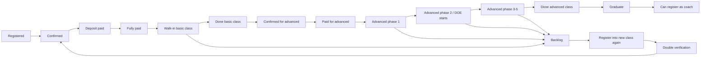

# Now Next Plan

## Purpose

This page is the operating guide for what AGA should do next when the Dcode project feels unclear.

The project is not only a Lark cleanup. It is a full scan of Dcode Sdn Bhd's current business system, with the goal of producing a project wiki, ontology, workflow map, current-state diagnosis, and ERP / AI-native upgrade path.

## What We Know Now

| Area | Current Understanding |
|---|---|
| Main audience | Dcode Sdn Bhd. |
| Delivery owner | AGA. |
| Output format | Project wiki under AGA. |
| Primary goal | Business process documentation first, then Lark Base usability and upgrade path. |
| Deadline | 4 June 2026 for upgrade path presentation. |
| Business backbone | Student registers, pays, joins basic class, completes basic, pays/continues to advanced, passes through 4-5 advanced phases, completes, graduates, then may register as coach. |
| Main pain | Dcode moved from Google Sheets into Lark Base, but still behaves like Google Sheets: duplicate tables, flexible columns, unclear source of truth, and leftover verbal logic. |
| Target direction | Move toward ERP first, then AI-native operations. |

## What To Do Now

### Step 1: Freeze The Language

Use the current ontology as the shared language:

- Person
- Student
- Registration
- Class Member
- Graduate
- Coach
- Payment
- Payment Plan
- Basic Class
- Advanced Class
- Advanced Phase
- DOE
- Backlog
- Report
- Workflow

Output:

- [Ontology Analysis](Ontology-Analysis.md) becomes the official object dictionary.

### Step 2: Map The Student Lifecycle First

Do not start by fixing every Lark table. Start with the student lifecycle because every table should eventually connect to it.

Confirmed lifecycle:

Output:

- [Business Logic Map](Business-Logic-Map.md) becomes the student lifecycle and business-rule reference.

### Step 3: Pick One Base As The Model Audit

Use `D.136 Class Bible. (admin dcode)` as the first model audit because it already has a deep extraction and contains many important business areas.

For each table in D.136, label:

- `source`
- `working`
- `derived`
- `reporting`
- `legacy`
- `unknown`

Output:

- D.136 becomes the example of how all other Bases will be reviewed.

### Step 4: Build The Source-Of-Truth Matrix

For each object, answer:

| Object | Question |
|---|---|
| Student | Which table should be the real student master? |
| Registration | Which table/form creates the first registration record? |
| Payment | Which finance table proves payment truth? |
| Class Member | Which Class Bible table proves the student is in class? |
| Advanced Phase | Which table records phase in/out? |
| DOE | Which table stores student DOE submissions? |
| Backlog | Which table records dropped or incomplete students? |
| Report | Which view/table is the approved final report? |

Output:

- One source-of-truth matrix for Dcode.
- [Dcode Canonical Source Of Truth Schema](Dcode-Canonical-Source-Of-Truth-Schema.md) is the target ERP model for this matrix.

### Step 5: Define The ERP Upgrade Path

AGA should recommend this direction:

| Layer | Recommended Role |
|---|---|
| Lark Base | Staff-facing operation UI. |
| Supabase / structured database | Clean ERP backend and source-of-truth layer. |
| Sync layer | Moves approved data between Lark and ERP backend. |
| Project wiki | Business and technical documentation. |
| AI layer | Future assistant/reporting/search layer after ontology and source-of-truth are stable. |

Do not jump directly to AI automation. First make the ERP truth clean.

Output:

- Upgrade path from messy Lark Base to ERP to AI-native company.

## This Week's Practical Checklist

- [ ] Confirm the ontology object list with Dcode leadership or PIC.
- [ ] Confirm the student lifecycle states.
- [ ] Confirm that fully paid is required for class entry.
- [ ] Confirm backlog definition: dropped or did not complete class.
- [ ] Confirm backlog re-entry rule: register again with double verification.
- [ ] Label all D.136 tables by role.
- [ ] Identify D.136 tables that are source, reporting, copied, or legacy.
- [ ] Create the first source-of-truth matrix.
- [ ] Create the first ERP upgrade-path summary for 4 June 2026.

## Questions Still Blocking Clarity

| Question | Why It Matters |
|---|---|
| Which table is the student master today? | Without this, every report can count students differently. |
| Which payment table is finance truth? | Fully paid is the class-entry gate. |
| Which table records advanced phase in/out? | Advanced class has 4-5 phases and must be tracked. |
| Which DOE table is final? | DOE reporting is one of the main outputs. |
| Which reports are needed at each class timing? | Reports vary by phase and are not fully known yet. |
| Who in Dcode approves report definitions? | Numbers need one final business owner. |

## Simple Mental Model

When confused, reduce the project to this:

1. What object is this data about?
2. What lifecycle state does it represent?
3. Which workflow created or changed it?
4. Which table is allowed to be the truth?
5. Which report consumes it?
6. What upgrade is needed: keep, clean, merge, archive, rebuild, or move to ERP backend?

That is the whole project.
