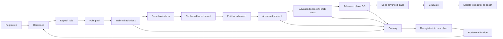

# Ontology Analysis

## Purpose

This ontology defines the business objects, relationships, states, and evidence types needed to understand Dcode as an education platform.

It should become the shared language between leadership, operations, coaches, finance, support, DOE, and technical/data teams.

## Core Business Objects

| Object | Meaning | Likely Source |
|---|---|---|
| Company | Dcode operating entity. | Workspace / ownership metadata |
| Program | A broad educational product or track. | Leadership definition |
| Course Level | Stage such as 基础, 高阶一, 高阶二, 高三, 高四, DOE. | Class Bible / program docs |
| Cohort | A numbered class cycle such as CP136. | Class Bible / DOE Bases |
| Class Session | A scheduled learning delivery event. | Calendar / operations tables |
| Person | Human identity before role-specific records. A person can become a student and, after graduation, may become eligible to register as a coach. | Future person master / Learner NEWBIBLE |
| Student | Person on the Dcode learning path. This is the business customer/learner identity, not the same thing as a registration record. | Learner NEWBIBLE / future student master |
| Coach | Person supporting or guiding learners. | Coach NEWBIBLE / coach roster |
| Registration | A pre-student intake record showing intent to join a class. This should be unique and clearly linked to one student path. | 课程报名 / forms |
| Class Member | Student actively attached to a class/cohort. | Class Bible |
| Graduate | Student who completed the required study phase. Only graduates can later register as coaches. | Final result / graduation records |
| Assignment | Relationship between learner, coach, cohort, and level. | Class Bible / coach tables |
| Attendance | Evidence that learner entered or attended. | Class Bible / operation fields |
| Payment | Money obligation and payment state. | Finance Bases |
| Payment Plan | Whether the student paid one-time full payment or separate staged payments for basic and advanced class. | Finance / registration |
| Declaration | DOE commitment, plan, or submitted statement. | DOE tables |
| Result | Outcome or achievement record. | Result / DOE tables |
| Grade | ABC or EMO segmentation. | Grade ABC tables |
| Backlog | Learner not currently active but still operationally relevant. | Backlog tables |
| Leave Case | Learner left after rules or another formal transition. | 守则后离开 tables |
| Report | Leadership or operational output. | Views / dashboards / final tables |
| Workflow | Rule that moves data or notifies people. | Lark workflow / manual SOP |

## Relationships

| Relationship | Meaning |
|---|---|
| Learner enrolls in Cohort | A person joins a numbered class cycle. |
| Cohort belongs to Course Level | A class cycle is attached to a learning stage. |
| Learner has Registration | Enrollment begins from intake or form data. |
| Learner has Payment | Finance state belongs to a person/course/cohort. |
| Learner assigned to Coach | Coaching responsibility is attached to a learner. |
| Coach serves Cohort | A coach supports a cohort or level. |
| Learner submits Declaration | DOE evidence is attached to learner identity. |
| Learner receives Grade | Segmentation or scoring is attached to learner identity. |
| Learner transitions to Backlog | Learner leaves current active path but remains follow-up relevant. |
| Backlog returns to Current | Old backlog can move into active cohort. |
| Graduate can register as Coach | Coach eligibility starts only after the student completes the learning path. |
| Table powers Report | Reporting is downstream from one or more tables/views. |
| Workflow updates Table | Automation changes a business object or state. |

## Lifecycle States

### Learner States

| State | Meaning |
|---|---|
| Registered | Person has a record in Dcode and has indicated intent to join. |
| Confirmed | Staff/call center has confirmed the student path. |
| Deposit Paid | Deposit received and waiting for finance verification if not yet approved. |
| Fully Paid | Required payment is complete. This is the gate for class entry. |
| Walk-In Basic Class | Student enters the basic class delivery flow. |
| Done Basic Class | Student completed basic class. |
| Confirmed For Advanced | Student is confirmed to proceed to advanced class. |
| Paid For Advanced | Advanced class payment requirement is complete, either through one-time full payment or separate advanced payment. |
| Advanced Phase Active | Student is inside one of the advanced class phases. Each phase needs explicit in/out tracking. |
| Advanced Phase Completed | Student completed one advanced phase. |
| Done Advanced Class | Student completed all required advanced phases. |
| Graduate | Student completed the study path and may become eligible to register as coach. |
| Backlog | Student dropped or did not complete the class, but remains operationally relevant. |
| Re-Registered From Backlog | Backlog student is registering into a new class path and requires double verification. |
| Dropped / 下车 | Student joined previously but dropped the class. |
| Left After Rules / 守则后离开 | Student joined previously and left after a formal rule point. |
| Transfer Payment / 转款 | Deposit/payment transferred. |
| Transfer Seat / 转名额 | Seat or entitlement transferred. |
| Closed | No further action expected. |

### Student Lifecycle Path

### Coach States

| State | Meaning |
|---|---|
| Candidate | Potential coach or applicant. |
| Confirmed | Approved for a cohort. |
| Assigned | Linked to learners or group. |
| Active | Currently coaching. |
| Completed | Finished cohort support. |
| Inactive | No current assignment. |

### Payment States

| State | Meaning |
|---|---|
| Unpaid | No payment confirmed. |
| Deposit Paid | Partial payment received. |
| Balance Due | Remaining amount exists. |
| Pending Verification | Payment has been submitted but finance has not approved the bank-in yet. |
| Fully Paid | Required amount complete. Only this state allows class entry. |
| Transferred | Money moved to another seat/course/person. |
| Refunded | Money returned. |
| Exception | Needs finance review. |

### Course Structure

| Structure | Meaning |
|---|---|
| Basic Class | First main class stage. It has one primary phase. |
| Advanced Class | Later class stage after basic class. It has 4-5 phases and requires in/out tracking for each phase. |
| DOE Start Point | DOE begins around advanced phase two / 高二. |
| Coach Eligibility | A student can register as coach only after graduation. |

## Source-Of-Truth Rules

| Object | Preferred Source-Of-Truth Rule |
|---|---|
| Learner identity | One learner master table per active operating model, not per copied report. |
| Coach identity | Coach NEWBIBLE or coach roster, depending on confirmed owner. |
| Cohort membership | Current Class Bible source table, not final report table. |
| Payment status | Finance-owned table, not copied fields in Class Bible unless synced. |
| DOE declaration | DOE source submission table. |
| Final outcome | Approved final result table with documented inclusion rules. |
| Backlog state | Backlog-owned lifecycle table, with clear return-to-current rule. |
| Schema changes | AGA should control table and column changes to protect data integrity. |

## Data Quality Risks

| Risk | Why It Matters |
|---|---|
| Same person copied across many tables | Reports can double-count or miss people. |
| CP135 tables inside CP136 Base | Legacy or copied logic may be mistaken as current. |
| 141-field masterlist copies | Similar schema suggests duplicated reporting layers. |
| Manual edits to derived tables | Derived reports can drift from source records. |
| Missing workflow/dashboard permissions | Cannot yet prove full automation logic. |
| Ambiguous Backlog meaning | Backlog may mean deferred, unconsumed, transferred, inactive, or still billable. |
| Open table/column creation | Staff can recreate Google Sheet-style chaos inside Lark Base unless schema governance is enforced. |
| Payment verification delay | Finance has too much payment evidence to verify quickly, delaying operational feedback. |

## Ontology Completion Output

The final ontology should produce:

1. Object dictionary.
2. Relationship map.
3. State model.
4. Source-of-truth matrix.
5. Field ownership matrix.
6. Workflow-to-object map.
7. Report-to-source lineage map.
8. Exception and transition rules.

## Canonical Schema

- [Dcode Canonical Source Of Truth Schema](Dcode-Canonical-Source-Of-Truth-Schema.md): clean ERP database schema using this ontology, with source-of-truth rules and Lark extraction mapping.
